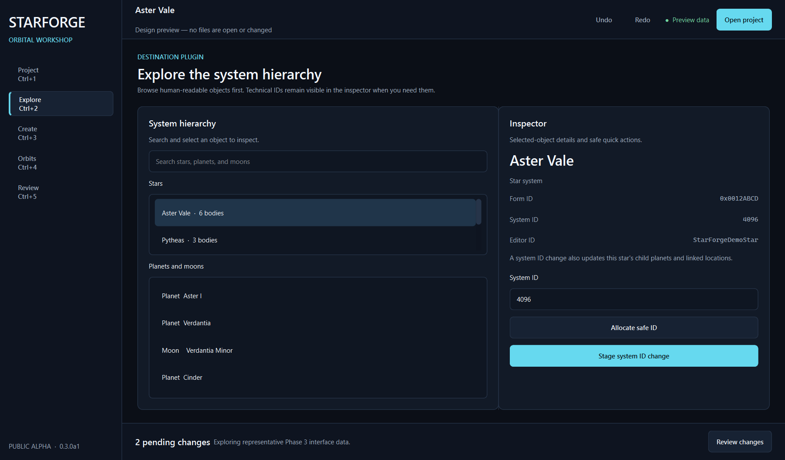

# StarForge

StarForge is a desktop and command-line toolkit for safely creating and editing
Starfield star systems, planets, moons, and orbital data.

The project is preparing its `0.3.0a1` public alpha. Its PySide6 desktop client
provides a guided, non-destructive authoring workflow, while the first-class CLI
supports coding agents and advanced users.



## Current capabilities

- inspect source and destination plugins
- clone stars, planets, and moons
- allocate and update system IDs
- edit orbital data and apply presets
- preview and stage changes before writing an output plugin
- preserve unsupported record data where possible

## Development status

Phases 1 through 5 are complete. StarForge now has a reproducible public foundation, a typed application
layer, a stable non-interactive CLI, and a polished guided UI over the same
engine. Project loading and validated export run in cancellable background jobs;
inputs remain protected and every pending write is reviewable.

Phase 5 hardening added bounded undo/redo, transactional rollback, protected
recovery snapshots, and filesystem/render regression coverage. See the
[`supported-operation matrix`](docs/SUPPORTED_OPERATIONS.md) for the exact
alpha boundary and known limitations. The private xEdit, Creation Kit, and
in-game validation matrix has passed.

Phase 6 adds reproducible Windows installer and portable artifacts, checksums,
optional code signing, and tag-driven GitHub releases. Start with the
[`five-minute guide`](docs/QUICKSTART.md) or join
[`public alpha testing`](docs/ALPHA_TESTING.md).

The public test suite builds compact synthetic plugins and archives at runtime.
Optional private compatibility tests remain excluded from version control. See
[`docs/PUBLICATION_SAFETY.md`](docs/PUBLICATION_SAFETY.md).

## Local development

StarForge requires Python 3.11 or newer and contains its required plugin-format
primitives in the `starforge.formats` package.

```powershell
python -m pip install -e .
python -m pytest
python -m starforge --help
python -m starforge gui
```

See [`docs/CLI.md`](docs/CLI.md) for commands, safety guarantees, JSON output,
and documented exit codes.

### Windows path length

PySide6 contains deeply nested QML files. On Windows systems without long-path
support, creating a development environment under a deeply nested directory can
fail during installation. Use a short path such as `C:\dev\StarForge` or enable
Windows long-path support. Packaged StarForge releases will use controlled,
short installation paths.

## License

StarForge is available under the [MIT License](LICENSE).
